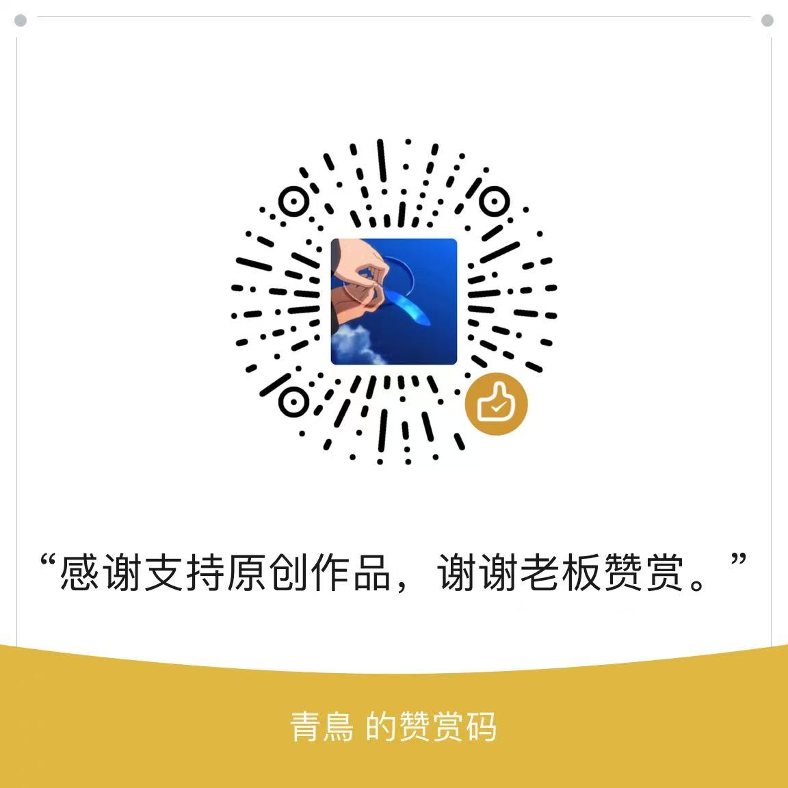

# Antigravity 一键汉化

> Google Antigravity（Agentic IDE）**Windows / macOS** 一键汉化工具
> **19022+ 翻译单元 · 双击即用 · 零联网 · 永久免费**

---

## 这是什么

[Antigravity](https://antigravity.google) 是 Google 出品的智能体编程 IDE，界面默认英文。
本工具把它完整变成简体中文——不需要懂命令行，不需要会编程：

- **双击 `一键汉化.bat`（Windows）/ `一键汉化.command`（macOS）**，按数字选功能
- 官方更新后界面变回英文？**再双击一次，重新汉化就好**
- 想换回英文原版？**一键还原**，还原结果与官方原版字节级一致

## 先看你是什么系统

| 你的系统 | 用哪个 | 启动方式 |
|---|---|---|
| **Windows** | 仓库根目录的 `一键汉化.bat` | 双击即用 |
| **macOS** | [`mac/`](mac/) 目录 | 右键 `一键汉化.command` → 选择「打开」 |

两个平台共用同一套引擎与词典（词条量、覆盖范围、备份策略完全一致），
`localize.py` 会自动识别当前系统走对应分支。

> macOS 用户请看 **[mac/README.md](mac/README.md)**，里面讲清了代码签名这件事，
> 以及遇到「应用已损坏」怎么办。

## 为什么选这个

| 优势 | 说明 |
|---|---|
| **词条量天花板** | 19022+ 翻译单元（主词典 18682 + 前缀规则 88 + 核心词 117 + 动态正则 61 + 菜单映射 74），规模远超目前市面上的同类汉化方案 |
| **覆盖最全面** | 不只翻网页界面——原生菜单栏、系统托盘、系统弹窗、安装向导、权限确认弹窗、输入框提示、IDE 面板词条，全都翻 |
| **双平台** | Windows 与 macOS 同一套脚本自动适配；macOS 版自动完成代码签名重签（Apple 官方推荐的分层方式） |
| **真·一键** | 双击 → 数字菜单 → 完成。杀进程、备份、注入、校验、部署全自动，不需要敲任何命令 |
| **官方更新不怕** | 独创"备份防降级"设计：官方更新后重汉化，备份自动升级为新版官方原版——还原永远不会把你退回旧版本 |
| **安全干净** | 全程本地操作，**零联网、零数据上传、零遥测**；写入前语法门禁、部署后二次复检，任何一步不对就中止回滚 |
| **原子替换** | 部署用"临时文件 + 原子替换"，中途断电、强杀进程都不会留下半成品损坏安装 |
| **不误伤** | 身份守卫：装错目标（--path 指向其他软件）直接拒绝执行；杀进程按路径过滤，其他软件的同名进程不受影响 |
| **AI 回复也中文** | 界面汉化管不到 AI 生成的内容，本工具内置"AI 中文回复"规则开关（菜单 4），一键让 AI 用中文回答 |
| **可自己改词典** | 词典是明文 JSON 文件，想补充或修改词条，编辑 `zh_data.json` 后重跑即可 |

## 使用方法

### 环境要求

**Windows：**

- Windows + 已安装 Antigravity（默认安装路径自动识别，装在别处可用 `--path` 指定）
- [Python](https://www.python.org/downloads/) 3.8+（安装时勾选 **Add Python to PATH**）
- [Node.js](https://nodejs.org) 18+（解包/打包安装包用）

**macOS**（详见 [mac/README.md](mac/README.md)）：

- macOS 12+ + 已安装 Antigravity
- Python 3.8+（`brew install python`）
- Node.js 18+（`brew install node`）
- **Xcode 命令行工具**（`xcode-select --install`）——提供 `codesign`/`xattr`，
  没有它汉化后 App 会打不开，主程序会在汉化前明确报错

### 操作菜单

Windows 双击 `一键汉化.bat`，macOS 右键 `一键汉化.command` →「打开」：

| 选项 | 功能 |
|---|---|
| `1` 一键汉化 | 自动关进程 → 备份原版 → 注入汉化 → 校验 → 部署（macOS 追加自动重签名） |
| `2` 恢复官方英文原版 | 用备份一键还原，字节级与官方一致 |
| `3` 查看状态 | 当前是否已汉化、备份是否完好（macOS 追加签名健康度） |
| `4` AI 回复中文化 | 写入一条全局规则，让 **AI 自己用中文回答**（思考过程仍英文，可随时关闭） |

也可以命令行调用：`python localize.py apply / restore / status / chinese-output`（macOS 用 `python3`）

> **想让 AI 的回复也是中文？** 选 `4`。界面汉化管不了 AI 生成的内容，
> 正确做法是加一条"用简体中文回复"的全局规则（脚本已内置该功能）。

### 官方更新后怎么办

Antigravity 官方更新后界面会变回英文——这是正常现象，不是坏了。
**再运行一次选项 `1` 重新汉化即可**，备份会自动升级为新版官方原版。
（macOS 上重签名也会一并重新完成）

## 汉化覆盖范围

- **网页界面**：侧边栏、对话流、设置全部子页、模型与用量、MCP 管理、权限沙盒、插件中心、远程控制、会话历史、IDE 面板（VS Code 侧词条）等
- **原生菜单**：顶部菜单栏（文件/编辑/视图/分屏/WSL 等 74 条）
- **系统托盘**：右键菜单、智能体运行计数
- **系统弹窗**：退出确认、更新检查、工作区选择、WSL 提示等
- **安装向导**：欢迎页文案
- **权限确认弹窗**：一直允许 / 仅允许一次 / 拒绝 / 跳过 等全套按钮
- **输入框提示**：placeholder / aria-label 提示文案（不触碰输入内容本身）

> 上表中 WSL 相关的 3 处弹窗是 **Windows 专属**，macOS 版本没有 WSL，
> 因此那几处在 Mac 上不会命中（脚本会明确说明"属正常现象"，不会报错）。
> 其余词条两平台通用。详见 [mac/README.md](mac/README.md#与-windows-版的两点客观差异不是缺陷)。

### 版本适配

当前深度适配 **Antigravity v2.21.1**（Windows 真机验证）。

| 版本 | 状态 |
|---|---|
| v2.21.1 | ✅ 深度适配，19 处静态锚点全部命中，真机实测通过 |
| v2.18.1 及更早 | ✅ 实测通过（词典向后兼容） |
| 更高版本 | ⚠️ 通常仍可用：词典翻译走运行时 DOM 匹配，不依赖固定文件结构。 官方改名的新功能可能需要更新词典，跑一次选项 `1` 即可自动补上已收录的部分 |

界面翻译采用**运行时 DOM 文本匹配**，不修改官方界面文件本身。
因此官方更新不会破坏已有汉化，只可能新增少量未收录的新文案。

**macOS 2.21.1 新增内容的处理**：官方在本版本新增了 macOS 专属的
隐私权限引导（「系统设置 > 隐私与安全性 > 文件与文件夹」）、
对话内容搜索（⌘+K）、操作分组折叠等界面元素，
这些词条已同步收录（词典共 18682 条）。

**官方更新后想补充新词条**：打开 `zh_data.json`，在 `exact` 段加一行
`"英文原文": "中文翻译"`，重新运行汉化即可。

### 刻意保留英文的内容（设计共识，不是遗漏）

| 内容 | 原因 |
|---|---|
| AI 思考过程（Thinking） | 流式推理内容不适合词典翻译，强行翻会夹生卡顿；正文/总结/计划是中文 |
| 模型名（Gemini、Claude 等） | 产品名，翻译会造成识别混乱 |
| 个别受控下拉选项 | 翻译会导致组件状态失配、界面卡死，以"能用"优先 |
| 代码与代码块 | 程序代码不该被翻译 |
| 你输入的内容 | 输入区物理隔离，永远不会动你打的字 |

## 自定义词典

所有词条都在 **`zh_data.json`** 一个文件里（明文 JSON）。想补充词条、改译法，直接编辑后重跑启动器即可，脚本会剥离旧翻译重新注入，不怕重复。

## 文件说明

| 文件 | 作用 |
|---|---|
| `一键汉化.bat` | Windows 双击入口（自动找 Python） |
| `localize.py` | 主程序：备份/注入/语法门禁/打包/部署/恢复/防并发/（macOS）代码签名重签 全流水线 |
| `engine.js` | 界面翻译引擎（注入到 Antigravity 内部运行） |
| `zh_data.json` | 词典数据（**19022+ 翻译单元**，想补充词条改这个文件后重跑即可） |
| `mac/一键汉化.command` | macOS 双击入口（自动找 Python3 / Node.js / codesign） |
| `mac/README.md` | macOS 专属说明与故障排查 |

## 注意事项

1. **杀毒软件可能误报**：修改其他程序的文件属于敏感行为，部分杀软会提示。本工具源码全部公开、可自行审查，添加信任/放行即可。
2. **运行前会自动关闭 Antigravity**：汉化和还原都需要先关闭应用，脚本会自动处理，不用手动关。
3. **备份文件别手动删**：安装目录里的 `app.asar.bak` 是还原用的官方原版备份，脚本会自动维护它。
4. **官方大版本更新后**：个别词条可能暂时失效（脚本会安全跳过，不报错不损坏），界面主体翻译不受影响；等本工具适配更新即可。
5. **支持 Windows 与 macOS**；Linux 暂不适用（脚本已预留分支，未做真机适配）。
6. **macOS 额外说明**：Mac 会对 `.app` 做代码签名，改包必然导致签名失效，
   本工具已在汉化/还原后自动重新签名（并保留 Electron 运行必需的 entitlements）。
   若弹出管理员密码框属正常流程；万一提示"应用已损坏"，见
   [mac/README.md](mac/README.md#q汉化完提示应用已损坏无法打开) 的一键修复命令。
7. **本工具属于非官方第三方魔改**：介意"改动软件本体"的用户请勿使用；使用即表示了解并接受这一点。
8. **认准唯一下载渠道**：请只从本仓库 Release 页下载，其他渠道的打包可能被动手脚。

## 安全声明

本工具可以接触你的 Antigravity 安装目录，安全底线如下（源码全部公开，欢迎自行审查）：

- **零联网**：全程无任何网络请求，不连任何服务器，无数据上报、无遥测、无"偷偷下载"
- **只动该动的**：仅读写 Antigravity 安装目录内的文件；不碰注册表、系统服务、启动项、驱动，不碰你的项目代码和 Antigravity 用户数据
- **可完全还原**：一键还原到官方原版，字节级一致；备份永不降级（官方更新后自动升级备份）
- **坏不了**：写入前语法门禁校验，部署后二次解包复检，任一环节失败立即中止并回滚；部署采用原子替换，不存在"改到一半"的状态
- **不误伤别的软件**：身份守卫校验目标确实是 Antigravity 才动手；杀进程只杀 Antigravity 安装目录下的进程（macOS 按完整可执行路径精确匹配，绝不误杀同名程序）
- **macOS 签名如实告知**：改包会破坏 Apple 代码签名，本工具自动重签并校验；
  重签用的是临时签名而非 Google 官方签名，不影响官方更新（更新后重跑一次即可）
- **输入内容绝对安全**：输入框、代码区、思考链物理隔离，词典翻译永远触碰不到你输入和生成的内容

## 免责声明

1. 本工具为**独立第三方工具**，与 Google、Antigravity 官方没有任何关联，也未经官方认可。
2. 本工具按"现状"提供，**不附带任何明示或默示的担保**。因使用或无法使用本工具导致的任何问题（包括但不限于软件异常、数据丢失、需要重装软件、**账号或服务受限等后果**），均由使用者自行承担。
3. 是否使用由你决定——修改软件本体属于个人学习研究行为，请自行评估风险并遵守当地法律法规及软件服务条款。
4. 请通过本仓库官方 Release 页获取本工具，从其他渠道获取的副本安全性与本作者无关。

## 支持作者

本工具**永久免费**。如果它帮到了你，可以请作者喝杯奶茶 🙂

**任何收费售卖本工具的行为都是倒卖，请拒绝并向平台举报；不幸付费购买的，可向售卖者要求退款。**

## 版权与授权

Copyright (c) 2026 青鸟（QingniaoDawn）· 详见 [LICENSE](LICENSE)

- 允许个人学习、自用，以及在**完整保留本声明和作者署名**的前提下免费分享原包
- **禁止商用、倒卖、收费分发**，禁止去除署名或冒充原创
